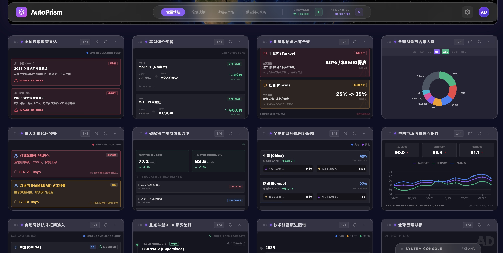
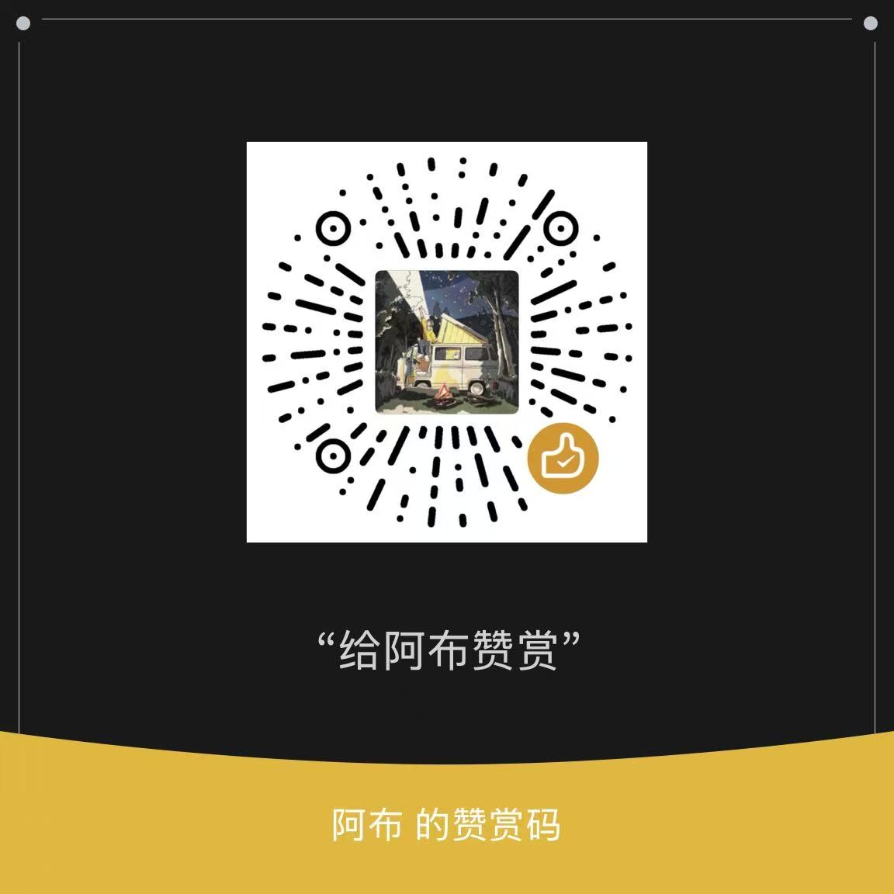

# AutoPrism 🌍


AutoPrism 是一款专为汽车产业与投资领域打造的**实时产业情报与全局数据看板**。

<div align="center">
  
  <br>
  <em>AutoPrism 全局指挥中心概览</em>
</div>
<br>
<div align="center">
  
  <br>
  <em>AutoPrism 结构化数据大盘与 AI 洞察流</em>
</div>
<br>

系统的核心护城河不在于“信息获取的数量”，而在于**“极致的结构化和降噪能力”**。AutoPrism 能够快速将全球新闻、供应链异动和竞品参数转化为直观的 3D 地图光柱、2D 战术热力图以及关键决策点，直击企业高管与投研机构的核心痛点。

---

## ✨ 核心特性 (Core Features)

- **🌍 双地图态势感知引擎 (Dual Map Engine)**
  - **宏观战略视角 (Globe View)**：基于 `globe.gl` 渲染的 3D 旋转地球，直观展示全球供应链断裂、地缘危机冲击节点。
  - **微观战术视角 (Tactical View)**：基于 `deck.gl` 的高性能 2D 散点图，轻松承载百万级别的终端销量数据和经销网络。
- **🧠 云端 AI 降噪管线 (AI Denoising Pipeline)**
  - 利用顶级云端大模型 (如 GPT-4o) 过滤全网海量公关稿和噪音。
  - **全自动坐标映射**：将非结构化新闻（如“德国工厂停产”）提炼为高危预警，并自动计算得出其实际物理经纬度坐标，直接点亮前端地图。
- **📊 动态车型对标库 (Dynamic Benchmarking)**
  - 采用 PostgreSQL `JSONB` 结构灵活存储行业内日新月异的技术指标（如端到端智驾算力、电池形态），告别死板的列式数据库。

---

## 🛠 技术栈 (Tech Stack)

### 前端 (Frontend)
* **框架**: React 18 + Vite + TypeScript
* **样式**: Tailwind CSS (定制化 `autoprism` 深色指挥中心主题)
* **渲染引擎**: `globe.gl` (Three.js), `deck.gl` (WebGL), `ECharts`
* **状态管理**: `Zustand`
* **交互**: `Framer Motion`, `@dnd-kit/core`

### 后端 (Backend)
* **框架**: Python 3.11+ + FastAPI
* **数据库**: PostgreSQL 16 + `asyncpg` (SQLAlchemy 2.0 ORM)
* **智能调度**: `httpx` (异步大模型 API 调用) + 后台轮询任务队列

---

## 🚀 快速开始 (Getting Started)

### 1. 配置云端 AI API (极其重要)
系统依赖大模型进行降噪和提取坐标。请在 `backend/.env` 中配置您的 API 密钥：
```bash
# 复制示例配置文件
cd backend
cp .env.example .env

# 在 .env 中填入您的模型配置
AI_API_BASE="https://api.openai.com/v1"  # 或使用百炼/Moonshot等其他兼容平台
AI_API_KEY="sk-xxxxxxxxxxxxxxxxxxx"      # 您的 API 密钥
AI_MODEL="gpt-4o"                        # 推荐使用 GPT-4o 或顶级国产大模型
```

### 2. 体验 AI 降噪与提取魔法 (本地脚本测试)
无需启动庞大的数据库，您可以直接运行测试脚本，亲眼目睹一段纯文本新闻是如何被“榨干”出坐标和风险权重的：
```bash
cd backend
python test_ai_pipeline.py
```
*您将会在终端看到大模型返回的结构化 JSON，包含了提取出的经纬度 `{lat: 52.5, lng: 13.4}`。*

### 3. 启动完整的后端服务 (API + 数据库)
如果您希望本地调试完整的前后端数据流，需要先启动 Docker 和 FastAPI：
1. 请确保您本地的 **Docker Desktop** 已经启动。
2. 在 `AutoPrism` 根目录下启动数据库容器：
   ```bash
   docker-compose up -d
   ```
3. 进入 `backend` 目录，安装依赖并启动后端：
   ```bash
   cd backend
   pip install -r requirements.txt
   uvicorn app.main:app --host 0.0.0.0 --port 8001 --reload
   ```
   *后端启动后，您可以通过 `http://localhost:8001/docs` 查看 Swagger 接口文档。*

### 4. 启动前端双地图大屏
确保您已安装 Node.js 环境：
```bash
cd frontend
npm install --legacy-peer-deps
npm run dev
```
打开浏览器访问 `http://localhost:5173`，点击面板右上角的切换按钮，即可在 3D 地球与 2D 战术视图间无缝切换！

---

## 📂 目录结构 (Project Structure)
```text
AutoPrism/
├── Architecture.md         # 系统整体技术架构设计方案
├── PRD.md                  # 产品需求文档
├── README.md               # 本文件
├── frontend/               # React + Vite 前端代码库
│   ├── src/components/maps # 核心地图渲染组件 (GlobeMap, DeckGLMap)
│   └── tailwind.config.js  # 指挥中心样式配置
└── backend/                # Python + FastAPI 后端代码库
    ├── app/models/sql.py   # 核心数据库漏斗模型 (RawIntelligence -> StructuredSignal)
    ├── app/services/ai_service.py # AI 降噪清洗引擎管线
    └── test_ai_pipeline.py # AI 提炼测试脚本
```

---

## ☕️ 赞赏与支持 (Support)

如果这个项目对你有帮助，欢迎通过微信赞赏码请我喝杯咖啡！你的支持是我持续开源和更新的动力。



---
*AutoPrism - Turning Chaos Into Clarity.*
